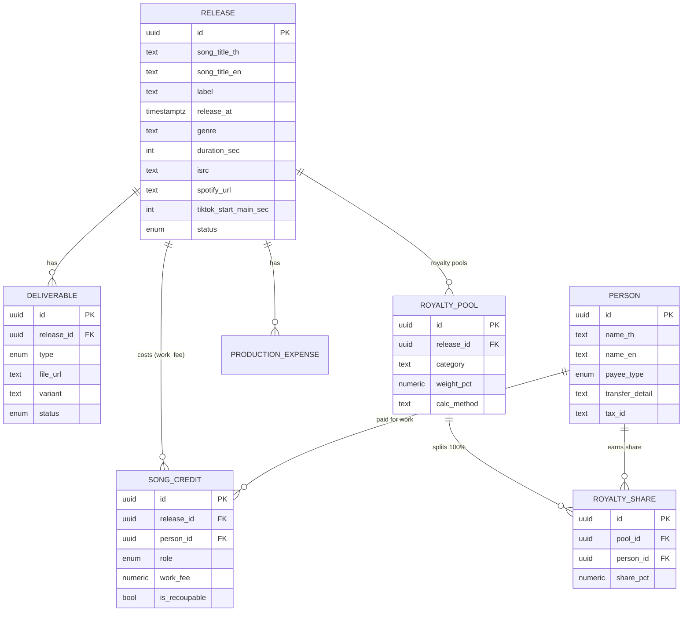

# ERP Data Model Spec — Music Label Operations (Handover)

**เอกสารส่งมอบสำหรับ dev ที่จะสร้าง ERP ใหม่** · บริษัท ครึ่งเก้า
สถานะ: Draft v1 · ขอบเขต: โมเดลข้อมูลของ (1) Metadata/Deliverables การส่งเพลง, (2) ค่าทำเพลง (Production Fee), (3) ส่วนแบ่งรายได้ (Royalty)

> จุดประสงค์: หลอมสิ่งที่ตอนนี้กระจายอยู่ใน Google Sheets หลายไฟล์ + แนวคิดใน Label-Ops แอปปัจจุบัน ให้เป็น **data model เดียว** ที่ ERP ใหม่เอาไปสร้างได้ เอกสารนี้เน้น "โครงสร้างข้อมูลและกฎ" ไม่ผูกกับภาษา/เฟรมเวิร์กใด

---

## 1. ที่มา (source artifacts)

| # | ไฟล์ | ให้ข้อมูลอะไร |
|---|---|---|
| A | `*_To Distributor` (เช่น ดีบุก – The Darkest Romance) | **Metadata + Deliverables** สำหรับส่งเพลงขึ้นจัดจำหน่าย |
| B | `*_Production Fee` (เช่น Jigsaw Story) | **ค่าทำงานต่อบทบาท/คน (fix rate)** + **Royalty %** + รายละเอียดการโอน + สรุปต่อคน |

Label-Ops แอปปัจจุบันมีบางส่วนแล้ว (`projects`, `project_assets`/DAM, `production_expenses` แบบ CBS Budget/Actual/Verified, `royalty_splits`) — เอกสารนี้ระบุว่าอะไร reuse ได้ อะไรต้องเพิ่ม (ดูหัวข้อ 7)

---

## 2. แนวคิดหลัก (design principles)

1. **แยก "ต้นทุน" กับ "ส่วนแบ่งรายได้" เป็น 2 มิติ แต่ผูกกับคนเดียวกัน (person).**
   - *ค่าทำงาน (one-time cost)* → `song_credit` ต่อ (เพลง × คน × บทบาท)
   - *ส่วนแบ่งรายได้ (ongoing royalty)* → **multi-pool**: `royalty_pool` (หัวข้อ + น้ำหนัก + วิธีคิด) → `royalty_share` (ส่วนแบ่งต่อคน, **แต่ละ pool รวม = 100%**)
   - ทั้งคู่อ้างกลับไปที่ `person` master → ดูภาพรวมต่อคนได้ (ค่าจ้างที่ได้ + ส่วนแบ่งที่ถือ)
2. **คน = master entity.** ชื่ออย่าง BOSSA / MONICA ใช้ซ้ำข้ามเพลง พร้อมข้อมูลการโอน/ภาษี → ทำเป็น **`person`** ไม่ใช่ text ลอย
3. **Metadata การจัดจำหน่ายเป็นชั้นข้อมูลของเพลง.** URL แพลตฟอร์ม, ISRC/UPC, genre, จุดเริ่ม TikTok ฯลฯ เป็นฟิลด์ของ **`release`**
4. **Deliverables เป็น checklist ต่อเพลง.** รายการไฟล์ที่ต้องส่ง (Master, Backing, Cover…) มี "ชนิด" ที่ตายตัว เพื่อเช็กความครบก่อนส่ง Distributor
5. **เครดิต 2 ภาษา.** ชื่อเครดิต TH + EN (คอลัมน์ C ในไฟล์ A) จำเป็นสำหรับ metadata จัดจำหน่าย

---

## 3. Entities

### 3.1 `release` (เพลง / single)
แกนกลาง — ขยายจาก `projects` เดิม

| field | type | หมายเหตุ |
|---|---|---|
| id | uuid (PK) | |
| song_title_th | text | ชื่อเพลง (ไทย) |
| song_title_en | text? | ชื่อเพลง (อังกฤษ/โรมัน) สำหรับ distributor |
| artist_display | text | ชื่อศิลปินอย่างที่แสดง (เช่น "Jigsaw Story Ft. MONICA") |
| label | text / FK→label | BRIDGE / MACHg / 9Arkkhan |
| primary_artist_id | FK→person? | ศิลปินหลัก (ถ้าทำ artist เป็น entity) |
| release_type | enum | Single / Album / Live Session / Concert / Other |
| release_at | timestamptz | วัน-เวลาปล่อย (มีเวลาจริง เช่น 18:00) |
| platforms | text[] / enum[] | เช่น All Platforms, Spotify, Apple, YouTube… |
| genre | text | แนวเพลง (Rock, Pop…) |
| duration_sec | int | ความยาว (วินาที) เก็บเป็นวินาทีจะคำนวณง่ายกว่า `04:00` |
| language | text? | ภาษาเพลง |
| is_explicit | bool? | สำหรับ distributor |
| isrc | text? | รหัส ISRC (distribution) |
| upc_ean | text? | รหัส UPC/EAN ระดับ release |
| spotify_url | text? | Artist/track URL |
| apple_url | text? | |
| youtube_url | text? | |
| tiktok_start_main_sec | int? | จุดเริ่มท่อน Main (วินาที) |
| tiktok_start_breakdown_sec | int? | จุดเริ่มท่อน Breakdown |
| lyrics | text? / link | เนื้อเพลง |
| master_file_url | text? | ไฟล์ Master .wav (หรือชี้ไป deliverable) |
| status | enum | draft → in_production → ready_to_submit → submitted → released |
| created_at / updated_at | timestamptz | |

### 3.2 `deliverable` (ไฟล์ส่งมอบ — checklist ต่อ release)
ขยายจาก `project_assets` (DAM) โดยเพิ่ม "ชนิดมาตรฐาน"

| field | type | หมายเหตุ |
|---|---|---|
| id | uuid (PK) | |
| release_id | FK→release | |
| type | enum (`deliverable_type`) | ดูหัวข้อ 4 |
| label | text? | ชื่อ/คำอธิบายไฟล์ |
| file_url | text? | ลิงก์ (Cloud) |
| local_backup | bool | สำรอง HDD/SSD แล้ว (มีในแอปเดิม) |
| status | enum | pending / received / approved |
| variant | text? | เช่น RBT: Main 30s / Breakdown 60s |
| created_at / updated_at | | |

> รายการ RBT/Ringtone มีได้หลายไฟล์ต่อ release → ใช้ `variant` แยก

### 3.3 `song_credit` (ผู้ร่วมงาน = ต้นทุน + ส่วนแบ่ง) ★ หัวใจ
หนึ่งแถว = (release × person × role)

| field | type | หมายเหตุ |
|---|---|---|
| id | uuid (PK) | |
| release_id | FK→release | |
| person_id | FK→person | |
| role | enum (`credit_role`) | ดูหัวข้อ 4 |
| credited_name_th | text | ชื่อเครดิตไทย (อาจต่างจากชื่อจริงใน person) |
| credited_name_en | text? | ชื่อเครดิตอังกฤษ (สำหรับ distributor) |
| work_fee | numeric(12,2) | **ค่าทำงาน (fix rate, one-time cost)** |
| payment_detail | text? | รายละเอียดจ่าย/โอน (เช่น "จ่ายที่ บริษัท … สนญ.") |
| remark | text? | เช่น "Fix rate ดีก 3000", "White Music" |
| is_recoupable | bool | ค่าทำงานนี้นำไปหักทุนคืนไหม (default true) |
| created_at / updated_at | | |

> **ส่วนแบ่งรายได้ (royalty) ย้ายออกจาก `song_credit` ไปเป็นโมเดล multi-pool** (3.3b) เพราะ royalty มีโครงสร้าง "หัวข้อ/pool + น้ำหนัก" ที่ค่าทำงานไม่มี — ดูหัวข้อ 3.3b และกฎ 5.2

### 3.3b `royalty_pool` + `royalty_share` (ส่วนแบ่งรายได้แบบหลายหัวข้อ) ★ โมเดลใหม่
Royalty แบ่งเป็น **หลายหัวข้อ (pool) — จำนวนไม่จำกัด** แต่ละ pool แบ่งกันในหมู่ผู้ร่วมงานให้ **รวม = 100%**

**`royalty_pool`** — หนึ่งหัวข้อส่วนแบ่งต่อ release
| field | type | หมายเหตุ |
|---|---|---|
| id | uuid (PK) | |
| release_id | FK→release | |
| category | text | ชื่อหัวข้อ เช่น Producer, คำร้อง, ทำนอง, เรียบเรียง, Artist … (เพิ่มได้ไม่จำกัด) |
| rights_type | enum? | `Master` / `Musical` — pool นี้อยู่ใต้สิทธิ์ไหน (เชื่อมกับชั้น business model, หัวข้อ 5.3) |
| weight_pct | numeric(6,3) | **น้ำหนักของ pool นี้** (ใช้คิด "แบบรวม" ฝั่งศิลปิน) |
| calc_method | text / enum | **วิธีคิดเงินของ pool** (แต่ละ pool ไม่เหมือนกัน) เช่น `per_stream`, `fixed`, `net_pct` |
| note | text? | |

**`royalty_share`** — ส่วนแบ่งของแต่ละคนภายใน pool
| field | type | หมายเหตุ |
|---|---|---|
| id | uuid (PK) | |
| pool_id | FK→royalty_pool | |
| person_id | FK→person | |
| share_pct | numeric(6,3) | ส่วนแบ่งภายใน pool · **Σ share_pct ต่อ pool = 100%** |
| note | text? | |

### 3.4 `person` (master ผู้รับเงิน/ผู้ร่วมงาน)
| field | type | หมายเหตุ |
|---|---|---|
| id | uuid (PK) | |
| name_th | text | |
| name_en | text? | |
| payee_type | enum | Individual / Company / Band |
| bank_account | text? | เลขบัญชี/ธนาคาร |
| transfer_detail | text? | ชื่อบัญชี / บริษัทที่จ่าย |
| tax_id | text? | เลขผู้เสียภาษี (สำหรับหัก ณ ที่จ่าย) |
| note | text? | |

### 3.5 (คงไว้) `production_expense` — CBS Budget vs Actual
ตารางงบประมาณรวมทั้งโปรเจกต์ (AUDIO MASTER, Music Video, Key Visual, Promo, Other) แบบ Budget/ใช้จริง/เกิดจริง (Maker-Checker) — **มีอยู่แล้วในแอปปัจจุบัน** ดูความสัมพันธ์กับ `song_credit` ในหัวข้อ 7 + ข้อตัดสินใจ 9.1

---

## 4. Enums (ควบคุมคำศัพท์)

**`credit_role`** (บทบาทค่าทำงาน — จากไฟล์ B): `Artist`, `Producer`, `Lyrics` (คำร้อง), `Melody` (ทำนอง), `Arrange`, `Lyric Director`, `Vocal Director`, `Musician`, `Mix`, `Edit`, `Mastering`, `Studio`, `Studio Engineer`
*(คนหนึ่งมีได้หลายบทบาทในเพลงเดียว → หลายแถว `song_credit`)*

**`royalty_pool.category`** (หัวข้อส่วนแบ่ง — **ไม่ fix จำนวน**, เพิ่มได้ตามจริง): เช่น `Producer`, `คำร้อง`, `ทำนอง`, `เรียบเรียง`, `Artist`, `Master Recording`, `Label` …
**`calc_method`**: `per_stream`, `fixed`, `net_pct`, … (แต่ละ pool ไม่เหมือนกัน — เพิ่มได้)

**`deliverable_type`** (จากไฟล์ A): `Master WAV`, `Lyrics`, `Backing Track`, `Minus One`, `LINE Ringtone 30s`, `Operator RBT`, `Single Cover 4000x4000`, `Artist Profile`, `Song Profile`, `PR Photo`
*(`Operator RBT` + `LINE Ringtone` ใช้ `variant` ระบุช่วง เช่น Main 0:30 / Breakdown 01:56)*

**`release_type`**: `Single`, `Album`, `Live Session`, `Concert`, `Other`
**`payee_type`**: `Individual`, `Company`, `Band`
**`release_status`**: `draft`, `in_production`, `ready_to_submit`, `submitted`, `released`
**`deliverable_status`**: `pending`, `received`, `approved`

---

## 5. กฎทางธุรกิจ / Validation

### 5.1 ค่าทำงาน (cost)
- `SUM(song_credit.work_fee)` ต่อ release = ต้นทุนค่าทำเพลง (ตรงกับ Grand Total ในไฟล์ B เช่น 100,000)
- สรุปต่อคน: `SUM(work_fee) GROUP BY person_id` (ตรงกับตาราง Summary)

### 5.2 ส่วนแบ่งรายได้ (royalty) — โมเดล multi-pool ★
> **เปลี่ยนจากของเดิม:** เงื่อนไข 14%/86% (contributor ได้นิดเดียว ค่ายเก็บที่เหลือ) เป็น **งานเก่า** — ERP ใหม่ใช้โมเดล **หลาย pool ที่แต่ละ pool = 100%**

- **(1) 100% ต่อหัวข้อ (ภายใน pool):** ในแต่ละ `royalty_pool` ผลรวม `royalty_share.share_pct` = **100%** เสมอ
  (เช่น pool "คำร้อง": ชัยกำพล 50% + ธนศักดิ์ 25% + MONICA 25% = 100%)
- **(2) 100% แบบรวม (ข้าม pool):** ส่วนแบ่งรวมต่อคน = `Σ over pools ( pool.weight_pct/100 × share.share_pct )`
  ถ้า `Σ weight_pct ของทุก pool = 100` → ผลรวมต่อคนทั้งหมดก็ = 100% (ถ้ามีส่วนของค่าย ให้ทำเป็น pool "Label/ค่าย" ด้วย)
- **(3) จำนวน pool ไม่จำกัด** และ **แต่ละ pool คิดเงินคนละวิธี** (`calc_method`) — เช่น Master คิด per-stream, Publishing คิด %net ฯลฯ
- **(4) recoup:** ก่อนแบ่งจริง หัก **ต้นทุนที่ recoupable** (`Σ song_credit.work_fee where is_recoupable`) ออกจากรายได้สุทธิก่อน แล้วค่อยกระจายตามส่วนแบ่งแบบรวม
  `payout(person) = (net_revenue − recoupable_cost) × combined_pct(person)`

**ความสัมพันธ์กับตัวเลขเก่า:** ค่าเดิมต่อคนต่อบทบาท (เช่น ชัยกำพล คำร้อง 1%) = `weight_pct(คำร้อง) × share_pct(ชัยกำพล ในกลุ่มคำร้อง)` → โมเดลใหม่แค่แยก 2 ตัวเลขนี้ออกจากกัน

### 5.3 ชั้น Business model — แบ่งสิทธิ์ ค่าย ↔ ศิลปิน (อยู่เหนือ pool)
> รายได้ถูกแบ่ง **ค่าย ↔ ศิลปิน ก่อน** ตามประเภทสิทธิ์ แล้ว *ฝั่งศิลปิน* ค่อยกระจายลง `royalty_pool` (5.2)

- **Mastered Rights** (สิทธิ์ในมาสเตอร์/สิ่งบันทึกเสียง): ค่าย/ศิลปิน **แล้วแต่ตกลง** เช่น **70/30** หรือ **80/20** (ต่อดีล/ต่อ release)
- **Musical Rights** (ลิขสิทธิ์ดนตรี — คำร้อง/ทำนอง): ค่าย/ศิลปิน **default 50/50**
- แต่ละ `royalty_pool` ติด `rights_type` (`Master`/`Musical`) เพื่อบอกว่ากระจาย "ฝั่งศิลปิน" ของสิทธิ์ไหน
- **Flow การคิดเงิน:** `รายได้ → แยกตาม rights_type → แบ่งค่าย/ศิลปิน (ตามดีล) → ฝั่งศิลปิน → pool (รวม 100%) → คน`
- ⚠️ **ส่วนของค่ายยังไม่คำนวณในสเปคนี้** — เป็นงาน business-model layer ที่จะลงรายละเอียดภายหลัง ตอนนี้เก็บแค่ **โครงสร้าง + ค่า default** (Mastered 70/30 หรือ 80/20, Musical 50/50)
- โครงสร้างแนะนำ: entity **`rights_deal`** ต่อ release (หรือต่อศิลปิน/สัญญา) เก็บ `mastered_label_pct/mastered_artist_pct`, `musical_label_pct/musical_artist_pct` — ดูร่าง SQL (ภาคผนวก, ทำเป็น optional/future)

### 5.4 Deliverables completeness
- ก่อนเปลี่ยน `release.status` → `ready_to_submit` ควรมี deliverable ครบตาม checklist ที่กำหนด (อย่างน้อย: Master WAV, Single Cover, Lyrics, Backing Track, Minus One, Artist/Song Profile, PR Photo)

### 5.5 เครดิต 2 ภาษา
- สำหรับ metadata จัดจำหน่าย ต้องมี `credited_name_en` ของบทบาทหลัก (Lyrics/Melody/Arrange/Producer/Artist) ครบ

---

## 6. ความสัมพันธ์ (ERD)



---

## 7. Mapping กับ Label-Ops แอปปัจจุบัน

| ERP entity | แอปปัจจุบัน | ต้องทำอะไร |
|---|---|---|
| `release` | `projects` | เพิ่มฟิลด์ metadata (URLs, genre, ISRC, duration, release_at+time, tiktok, platforms, en title) |
| `deliverable` | `project_assets` (DAM) | เพิ่ม `type` (enum มาตรฐาน) + `variant` + checklist ความครบ |
| `song_credit` | `production_expenses`(AUDIO MASTER) | **ใหม่** — ค่าทำงาน (cost) ต่อคนต่อบทบาท |
| `royalty_pool` + `royalty_share` | `royalty_splits` (เดิมบังคับ 100% รวดเดียว) | **ใหม่** — หลาย pool, แต่ละ pool = 100% + น้ำหนัก + วิธีคิด |
| `person` | payee เป็น text | **ใหม่** — ทำ master + ข้อมูลโอน/ภาษี |
| `production_expense` | `production_expenses` (CBS) | คงไว้สำหรับงบรวมทั้งโปรเจกต์ (MV/Key Visual/Promo) |

---

## 8. ตัวอย่างจริง (จาก 3 ไฟล์)

### 8.1 Release — "ดีบุก" / The Darkest Romance (ไฟล์ A)
```
song_title_th: ดีบุก
artist_display: The Darkest Romance
label: BRIDGE
release_at: 2026-10-27T18:00:00+07:00
platforms: [All Platforms]
genre: Rock
duration_sec: 240            # 04:00
spotify_url: https://open.spotify.com/artist/10vdwasvbt93WOHGeeSD7M
apple_url:   https://music.apple.com/th/artist/the-darkest-romance/1093307563
youtube_url: https://music.youtube.com/@tdrthailand
tiktok_start_main_sec: 30            # 0:30
tiktok_start_breakdown_sec: 116      # 01:56
```
credits (metadata): Lyrics/Melody = ธิติวัฒน์ รองทอง (EN: Thitiwat Rongthong); Arranger/Producer = The Darkest Romance
deliverables: Master WAV, Lyrics, Backing Track, Minus One, LINE Ringtone 30s, Operator RBT (Main30/Break30/Main60/Break60), Single Cover 4000x4000, Artist Profile, Song Profile, PR Photo

### 8.2 Song credits — "จักรวาลไหน" / Jigsaw Story Ft. MONICA (ไฟล์ B)

**(ก) ค่าทำงาน `song_credit` (cost)** — รวม = Grand Total 100,000
| person | role | work_fee |
|---|---|---:|
| ชัยกำพล จันทรักษ์ | Artist | 3,000 |
| BOSSA | Producer | 5,000 |
| ชัยกำพล จันทรักษ์ | Lyrics | 5,000 |
| ชัยกำพล จันทรักษ์ | Melody | 5,000 |
| BOSSA | Arrange | 6,000 |
| ชัยกำพล จันทรักษ์ | Lyric Director | 2,000 |
| MONICA | Musician | 15,000 |
| BOSSA | Musician | 44,000 |
| BOSSA | Mix / Edit / Mastering | 5,000 ×3 |
| **รวม** | | **100,000** |
*(rollup ต่อคน: BOSSA 70,000 · MONICA 15,000 · ชัยกำพล 15,000)*

**(ข) Royalty — โมเดลใหม่ multi-pool (แต่ละ pool = 100%)**
แตกค่าเก่า (ต่อคน = น้ำหนัก × ส่วนแบ่งในกลุ่ม) เป็นตัวอย่าง:
| pool (category) | weight_pct | royalty_share (รวม = 100%) |
|---|---:|---|
| คำร้อง (Lyrics) | 2.0% | ชัยกำพล 50% · ธนศักดิ์ 25% · MONICA 25% |
| ทำนอง (Melody) | 2.0% | ชัยกำพล 100% |
| เรียบเรียง (Arrange) | 1.0% | BOSSA 100% |
| Producer | 1.5% | BOSSA 100% |
| Artist | 6.0% | ชัยกำพล 50% · MONICA 50% |
| … (เพิ่ม pool อื่นได้) | … | … |

- **100% ต่อหัวข้อ:** ทุก pool ด้านขวา รวม = 100% ✅
- **แบบรวมต่อคน** = Σ(weight × share) เช่น ชัยกำพล คำร้อง = 2%×50% = **1%** (ตรงกับค่าเก่า)
- *(ตัวเลข weight/share ด้านบนเป็นตัวอย่างการแตกค่า — ค่าจริงให้ยืนยันตอนกรอก)*

---

## 9. ข้อตัดสินใจที่ dev ERP ต้องเคาะ

1. **`song_credit.work_fee` vs `production_expense` (CBS AUDIO MASTER) เป็น source เดียวหรือคู่ขนาน?**
   แนะนำ: ให้ `song_credit` เป็น source ของค่าทำเพลง แล้ว CBS "AUDIO MASTER" ดึงยอดรวมมาแสดง (ไม่กรอกซ้ำ)
2. **Royalty model — เคาะแล้ว:** multi-pool, แต่ละ pool = 100%
   - (ก) **แบบรวม:** ใช้สูตร `Σ(weight × share)` **ไปก่อน** ✅
   - (ข) **ส่วนของค่าย:** ไม่คิดในสเปคนี้ — ไปอยู่ชั้น **business model** (หัวข้อ 5.3): **Mastered Rights** (70/30 หรือ 80/20) + **Musical Rights** (default 50/50) แบ่ง ค่าย↔ศิลปิน ก่อน แล้วฝั่งศิลปินค่อยลง pool
   - (ค) **recoup:** ยังไม่ fix — **ค่อยกำหนดภายหลัง** (เก็บ `is_recoupable` ไว้รองรับ)
3. **Artist เป็น entity แยกจาก person ไหม?** (ศิลปิน/วง มี URL แพลตฟอร์มของตัวเอง ใช้ซ้ำหลายเพลง) — แนะนำให้มี `artist` เบาๆ หรือ reuse `person(payee_type=Band/Individual)`
4. **ISRC/UPC generation:** ออกเองหรือรับจาก distributor?
5. **หัก ณ ที่จ่าย (WHT):** ต้องคำนวณ/ออกเอกสารจาก work_fee ไหม (เลยขอบเขตไฟล์นี้ แต่ `person.tax_id` เผื่อไว้แล้ว)
6. **Deliverable checklist** ต่างตาม release_type ไหม (Single vs Album)

---

## 10. ภาคผนวก — ร่าง Postgres schema (อ้างอิง, ปรับได้)

```sql
create table person (
  id uuid primary key default gen_random_uuid(),
  name_th text not null,
  name_en text,
  payee_type text not null default 'Individual'
    check (payee_type in ('Individual','Company','Band')),
  bank_account text,
  transfer_detail text,
  tax_id text,
  note text,
  created_at timestamptz not null default now()
);

create table release (
  id uuid primary key default gen_random_uuid(),
  song_title_th text not null,
  song_title_en text,
  artist_display text,
  label text,
  release_type text not null default 'Single',
  release_at timestamptz,
  platforms text[] default '{}',
  genre text,
  duration_sec int,
  language text,
  is_explicit boolean default false,
  isrc text,
  upc_ean text,
  spotify_url text,
  apple_url text,
  youtube_url text,
  tiktok_start_main_sec int,
  tiktok_start_breakdown_sec int,
  lyrics text,
  master_file_url text,
  status text not null default 'draft'
    check (status in ('draft','in_production','ready_to_submit','submitted','released')),
  created_at timestamptz not null default now(),
  updated_at timestamptz not null default now()
);

create table song_credit (
  id uuid primary key default gen_random_uuid(),
  release_id uuid not null references release(id) on delete cascade,
  person_id  uuid not null references person(id),
  role text not null,
  credited_name_th text,
  credited_name_en text,
  work_fee numeric(12,2) not null default 0,
  payment_detail text,
  remark text,
  is_recoupable boolean not null default true,
  created_at timestamptz not null default now(),
  updated_at timestamptz not null default now()
);
create index idx_song_credit_release on song_credit(release_id);
create index idx_song_credit_person  on song_credit(person_id);

-- Royalty: หลาย pool ต่อ release, แต่ละ pool แบ่งกันให้รวม = 100%
create table royalty_pool (
  id uuid primary key default gen_random_uuid(),
  release_id uuid not null references release(id) on delete cascade,
  category text not null,                 -- Producer / คำร้อง / ทำนอง / เรียบเรียง / Artist …
  rights_type text,                       -- 'Master' | 'Musical' (เชื่อมชั้น business model)
  weight_pct numeric(6,3) not null default 0,  -- น้ำหนัก pool (ฝั่งศิลปิน, ใช้คิดแบบรวม)
  calc_method text,                       -- per_stream / fixed / net_pct …
  note text,
  created_at timestamptz not null default now()
);
create index idx_royalty_pool_release on royalty_pool(release_id);

create table royalty_share (
  id uuid primary key default gen_random_uuid(),
  pool_id uuid not null references royalty_pool(id) on delete cascade,
  person_id uuid not null references person(id),
  share_pct numeric(6,3) not null default 0,   -- Σ share_pct ต่อ pool = 100
  note text,
  created_at timestamptz not null default now()
);
create index idx_royalty_share_pool   on royalty_share(pool_id);
create index idx_royalty_share_person on royalty_share(person_id);

-- Business-model layer (optional/future): แบ่ง ค่าย ↔ ศิลปิน ก่อนลง pool
-- ยังไม่คิดส่วนค่ายในเวอร์ชันนี้ — เก็บโครงสร้าง + default ไว้
create table rights_deal (
  id uuid primary key default gen_random_uuid(),
  release_id uuid not null references release(id) on delete cascade,
  mastered_label_pct  numeric(6,3) not null default 70,   -- เช่น 70/30 หรือ 80/20
  mastered_artist_pct numeric(6,3) not null default 30,
  musical_label_pct   numeric(6,3) not null default 50,   -- default 50/50
  musical_artist_pct  numeric(6,3) not null default 50,
  note text,
  created_at timestamptz not null default now()
);

create table deliverable (
  id uuid primary key default gen_random_uuid(),
  release_id uuid not null references release(id) on delete cascade,
  type text not null,
  label text,
  file_url text,
  local_backup boolean not null default false,
  variant text,
  status text not null default 'pending'
    check (status in ('pending','received','approved')),
  created_at timestamptz not null default now(),
  updated_at timestamptz not null default now()
);
create index idx_deliverable_release on deliverable(release_id);

-- กฎ: Σ royalty_share.share_pct ต่อ 1 pool = 100 (บังคับใน app layer หรือ trigger)
-- แบบรวมต่อคน = Σ over pools ( pool.weight_pct/100 × share.share_pct )
-- recoup: payout = (net_revenue − Σ recoupable work_fee) × combined_pct(person)
```

---

*เอกสารนี้เป็นร่างสำหรับส่งมอบ — ปรับชื่อฟิลด์/enum ให้ตรงกับมาตรฐาน ERP ของทีมได้ แนวคิดสำคัญ: `song_credit` = ต้นทุนค่าทำงาน · Royalty เป็น **multi-pool ที่แต่ละ pool = 100%** + น้ำหนัก + วิธีคิดต่าง pool + recoup · Person เป็น master · Metadata/Deliverables เป็นชั้นของ release*
